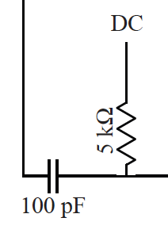

Sample holder pcb design
========================

The goal of this project is design a new daughterboard for the current low
frequency sample holder. The idea is to make room for new components that need
to be mounted on the board. Since we are trying not to change the motherboard,
the design is constrained.

Currently the daughterboard provides access to 24 DC lines and 6 RF lines and
does not have any space to solder SMC components. The goal is to design a board
fitting as many components as possible on the top layer (see below) while
respecting the following constraints:

- the position of contacts on the bottom layer must remain identical (to
  connect to the motherboard).
- the board should be extended to be as wide as the motherboard but has to
  remain of the same size in the long axis of the motherboard
- The central sample space should be reduced to a 7x7 mm square.

The improvements we are targeting are the following:

- integrate bias-tees to combine 4 RF and DC lines (the bias-tee should be
  composed of a 5 kΩ resistor on the DC line and a 87 or 100 pF capacitor on
  the RF line. The feasibility of adding a 100 nH coil on the DC line (before
  the resistor) should be studied. 
- integrate resonant a tank circuit on the remaining 2 RF lines, see
  https://link.aps.org/doi/10.1103/PhysRevApplied.5.034011 figure 1 a. The tank
  circuit is composed of two variable capacitances (see inset with a dashed
  frame), an inductor and is connected through a 5 kΩ resistor to a DC line.
  The resistor in parenthesis in the schematic is simply used for modelling
  purposes. An alternative design without the variable capacitances should
  also be considered.
- allow to mount a 5 kΩ resistor on all remaining DC lines.

Resistor and fixed capacitances should all be available in 0402 packaging
(this is the standard nomenclature for SMC and you should be able to easily
find the size for the soldering pads). For the inductances, we will consider
the following series: https://www.coilcraft.com/pdfs/0805cs.pdf. For the
varactances (used in the tank circuit), we will use this reference
https://cdn.macom.com/datasheets/MA46%20Series.pdf and the following packaging
ODS-1056.

To design the PCB, you can use EAGLE (see with Kasra for installation). Here
are a couple of introduction videos:
- https://www.youtube.com/watch?v=1AXwjZoyNno
- https://www.youtube.com/watch?v=RIfX3fxSpNY
- https://www.youtube.com/watch?v=B_SbQeF83XU
- https://www.youtube.com/watch?v=_G0ikZKB_Ss
